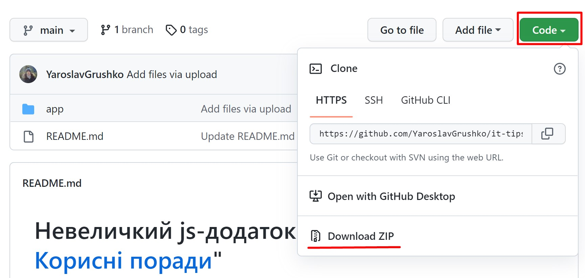

# Невеличкий js-додаток до YouTube каналу "[ІТ. Корисні поради](https://www.youtube.com/channel/UCnBbVgkiaAbr19Y_H9zDmYA)"

Секція: "браузер"\
Порада: [#2 (YouTube відео-порада)](https://youtu.be/mLUTDSG-HUU)

**Перед тим як скачувати цей додаток:**
- скачайте та встановіть браузер "Google Chrome"

**Як запустити наш тестовий js додаток:**
1. натисніть "Code", далі скачайте додаток за допомогою кнопки "Download ZIP":

2. розархівуйте у зручну для Вас папку
3. відкрийте папку, далі відкрийте папку "app", потім правою кнопкою мишки на файлі "index.html", відкрити за допомогою "Google Chrome" 
4. відкрийте [відео-пораду на YouTube](https://youtu.be/mLUTDSG-HUU) і дотримуйтесь інструкцій 
